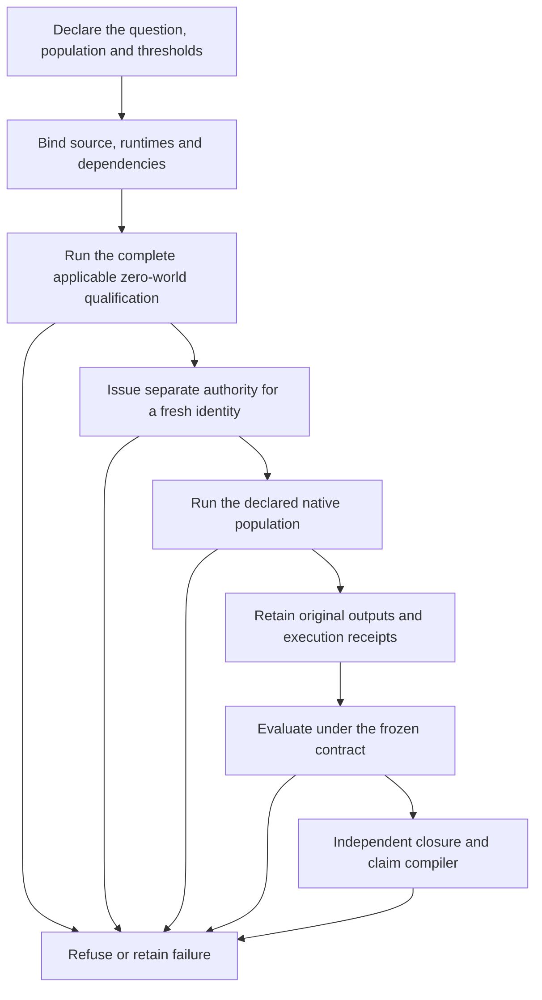

# Experiments that have to account for themselves

A run can finish and still be invalid. A valid run can fail the physical task.
A qualification pass can authorize no physics at all. The harness keeps those
cases separate all the way through the final claim.

## The lifecycle



The exact sequence and scope belong to each campaign contract. Development
diagnostics and formal finite acceptance have different authority. The diagram
does not turn every historical workflow into the same state machine.

## Walk through a real chain

1. **Qualification:** [R10DH v2](../sdk/recovery/r10dh_development_qualification_v2.json)
   binds the source freeze and production route, lists the real safety stages
   and retains their receipts. Passing it does not award a recovery milestone.
2. **A failed attempt stays failed:** the [original production closure](../sdk/recovery/r10dh_production_ghost_closure_v1.json)
   retains a world whose worker finished but whose original reader refused
   `R10DH_REPORT_IDENTITY`. The kicked cell did not open. That is an
   infrastructure-invalid attempt, not a physical success or a valid negative.
3. **A distinct successor:** [the v2 production pair](../sdk/recovery/r10dh_production_ghost_closure_v2.json)
   records the fresh corrected route. It does not rewrite v1.
4. **Finite acceptance:** [the held-out closure](../sdk/recovery/r10dh_held_out_physical_closure_v2.json)
   checks all six declared cells and the original workflow. The
   [adoption record](../sdk/recovery/r10dh_release_gate_adoption_v2.json) gives M07
   its narrow Godot/Jolt scope.
5. **Claims are checked again:** the [SDK1 compiler](../sdk/compile_quadruped_sdk1_milestone_readiness.ps1)
   reads the executable release boundary. The
   [package adoption controls](../sdk/release/test_sdk1_package_adoption.py)
   exercise corrupted receipt hashes and an unsupported full-program claim.

For a valid physical negative, inspect [Recovery Panel C](../sdk/discovery/recovery_panel_c_closure_v1.json):
four valid worlds, two positive cells, two negative cells and zero positive
pairs. Its complete execution does not make the population successful.

## Inspect it without opening a world

From the repository root, with Python 3.11+:

```powershell
python sdk/publication/evidence.py list
python sdk/publication/evidence.py show recovery-invalid
python sdk/publication/evidence.py verify
```

These commands only read the curated index and files. They do not qualify a
campaign, authorize a run, or rerun an evaluator. The verifier reports external
artifacts separately instead of treating their absence as a passed experiment.

The original qualification and release commands often require the original Git
history, full dependency closure, retained evidence and exact runtimes. Keep
their refusal behavior intact. A portable harness package would need its own
dependency definition, qualification and release decision.

## What the harness buys you

- A source change cannot quietly inherit an old qualification.
- Missing telemetry cannot quietly become a zero and pass a threshold.
- A failed or consumed identity cannot be treated as a fresh experiment.
- A new support claim needs the evidence required by its gate.

These are properties of the declared and tested paths. They are not a blanket
certification of every script, every future campaign or another research domain.
The [proof index](../proof/README.md) is a readable selection from that history.
