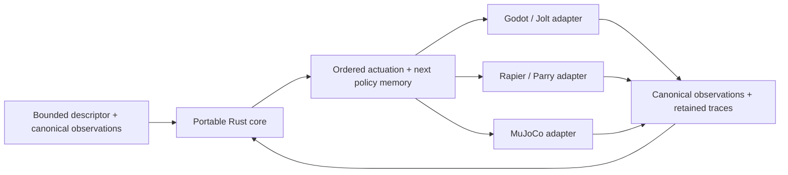

# Portable locomotion

LoColemotion separates canonical control from the engine that carries it out.
The Rust core compiles bounded quadruped descriptors and produces ordered
actuation commands. Each adapter maps those commands into native constraints,
motors and observations.

The interfaces are shared. The physics, solver behavior and measurement timing
still need to be checked in each engine.

## Read the support at its actual scope

| Capability | What the retained records support | Where to inspect it |
| --- | --- | --- |
| Portable core and API | Standalone source package consumed outside the game tree; all 83 declared native exports exercised | [Package closure](../sdk/release/sdk1_package_acceptance_closure_v1.json) |
| Godot/Jolt walking envelope | An exact finite union: 12 morphology points / 36 walking worlds and four material profiles / 12 treatment worlds; not their Cartesian product | [Envelope decision](../sdk/release/qsdk_r13_godot_jolt_sdk1_envelope_decision_v1.json) |
| Rapier/Parry and MuJoCo walking | Finite selected-policy walking and material evidence, with per-engine scope in the matrix | [Support matrix](../sdk/release/quadruped_support_matrix.json) |
| Three-engine turning | Seed 23199, three engines by three arms; all nine declared cells | [R23D78](../sdk/turning/r23d78_production_route_three_engine_turning_validation_closure_v1.json) |
| Godot/Jolt push and recovery | Exact S169, retained V28 runtime, phases 72–74, three kicked cells and three matched controls | [R10DH adoption](../sdk/recovery/r10dh_release_gate_adoption_v2.json) |
| Canonical prone-to-standing | SDK1 M19 passed under its frozen per-engine contract; do not infer equivalent push recovery in all engines | [SDK1 receipt](../proof/receipts/sdk1-clean-readiness.json) and [recovery records](../sdk/recovery/README.md) |
| Explorer and Studio | Native development sessions and recorded playback; separate from physical acceptance | [Showcase guide](SHOWCASE.md) |

The replay bundled here comes from the Explorer interface closure. It is useful
for seeing the implementation move, but the records above carry the acceptance
claims. Different sessions have different initial states and schedules.

## Integration details that matter

Start with [the engine comparison](../sdk/docs/ENGINE_INTEGRATION_COMPARISON.md).
It covers the mistakes that can survive a perfectly valid schema: joint signs,
force versus impulse limits, solver staging and the time at which observations
are sampled. The MuJoCo force-sampling example shows why a later recomputation
can hide what happened during the completed step.

- [Core and bindings](../sdk/README.md)
- [Standalone integration](../sdk/docs/QUADRUPED_SDK_INTEGRATION.md)
- [Authoring an adapter](../sdk/adapter_kit/README.md)
- [Godot/Jolt engine patches](../sdk/adapters/godot/engine_patches/README.md)
- [Rapier telemetry patches](../sdk/adapters/rapier/engine_patches/README.md)
- [MuJoCo adapter](../sdk/adapters/mujoco/README.md)

Formal cross-engine equivalence and non-inferiority remain unproved. So do
arbitrary-body coverage, continuous morphology coverage and broad environmental
robustness. A development session that moves successfully does not expand those
claims.
