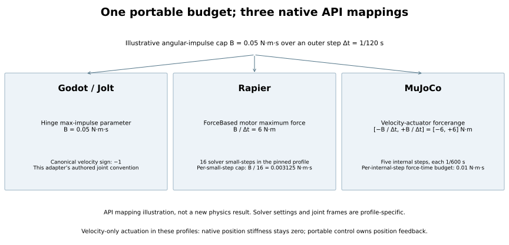
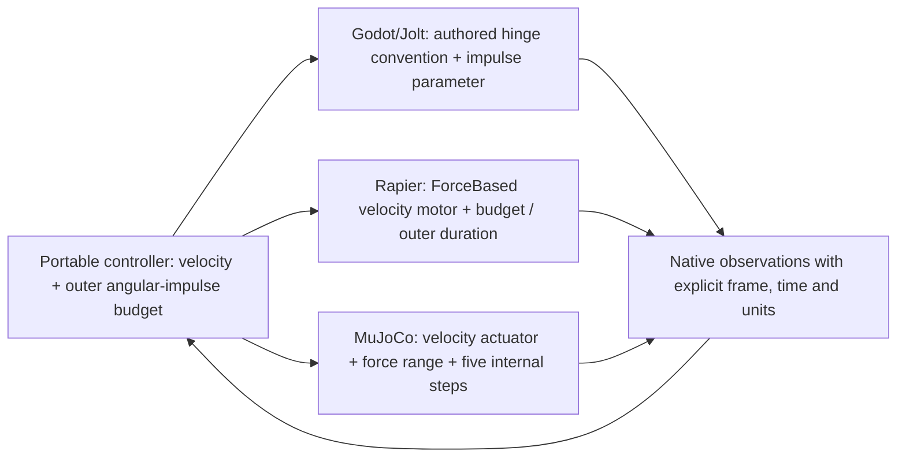
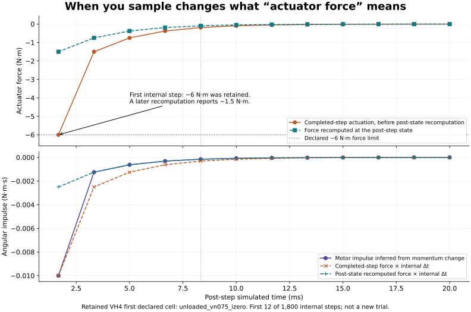

# What changed when the same locomotion SDK met three physics engines

The portable contract carries body geometry, ordered observations, target
velocities and angular-impulse budgets. A working host adapter must also choose
joint frames, native motor semantics, solver timing and the precise point at
which an observation is sampled. Those choices are part of the physical model.
Matching a JSON schema alone does not make the resulting trajectories equivalent.

This comparison describes the specific retained LoColemotion integrations. It is
not a ranking of Godot/Jolt, Rapier or MuJoCo, and the settings below are not
universal recommendations for those engines. Current claim scope remains in the
[support matrix](../release/quadruped_support_matrix.json). The downloadable
PNG/SVG figures and full 1,800-row illustrative trace export are identified by
the [figure record](../explorer/studio/engine_integration_figures_v1.json).

## The integration table

| Concern | Godot / Jolt route | Rapier route | MuJoCo route |
|---|---|---|---|
| Application boundary | Godot scene/physics objects and GDScript adapter, with the portable Rust controller behind a GDExtension | Rust host, explicit physics pipeline and joints | Python host builds an MJCF model and calls the portable Rust core through its C ABI |
| Velocity convention in these authored joint frames | Canonical target multiplied by **−1** | Canonical target multiplied by **+1** | Canonical target multiplied by **+1** |
| Native actuator command | Hinge target velocity with the declared max-impulse parameter | Explicit **ForceBased** velocity-only motor | Force-limited **velocity** actuator |
| Position feedback | Owned by the portable controller; no independent native position stiffness in this host profile | Native position stiffness stays zero; velocity damping is 10 N·m·s/rad in the characterized profile | No independent native position target; velocity gain is 10 N·m·s/rad in the characterized profile |
| Angular-impulse budget `B` over outer duration `Δt` | Pass `B` to the hinge max-impulse parameter and verify native readback | Set maximum force to `B / Δt`; the pinned profile's small-step impulse ceiling is `B / 16` | Set symmetric `forcerange` to `±B / Δt`; sum absolute force-time over five internal steps |
| Time and solver configuration discussed here | The current recovery worker uses a 1/120 s outer schedule and Jolt velocity/position iteration settings of 20/4 | The characterized ForceBased profile pins 16 solver small-steps, three internal PGS iterations and five stabilization iterations | Five 1/600 s `implicitfast` steps per 1/120 s portable command |
| Coordinate work | Preserve authored hinge axes and distinguish native target convention from canonical velocity | Preserve canonical axes and authored revolute-joint frames | Convert canonical `(x, y, z)` to MuJoCo `(x, −z, y)`; MuJoCo is Z-up in this model |
| Observation work exposed by this project | Recovery requires contact-frame and energy observations supplied by the instrumented engine; the full diagnostic route is expensive | Read back motor model, targets and force settings; interpret the reported motor impulse at the correct solver small-step scale | Distinguish completed-step force, force recomputed at the post-step state, and momentum-inferred effective impulse; refresh derived poses before displaying them |
| What the cited scalar host evidence establishes | This column describes the retained target mapping and recovery integration; it is not a newly commissioned scalar host study | VH1 passed its exact **12-cell** signed target/load grid | VH4 passed its exact **24-cell** target/load/initial-condition grid and retained **43,200** temporally explicit internal-step rows |

The signs in the table belong to these adapters' joint conventions. They are
not statements that an engine intrinsically has a reversed sense of rotation.
Likewise, solver iterations, solver small-steps and independently integrated
substeps must not be treated as interchangeable counters.

The mapping authorities are the
[canonical host profiles](../core/src/canonical_actuation.rs),
[Rapier live integration](../adapters/rapier/src/velocity_only_live_integration.rs),
[MuJoCo selected-policy integration](../adapters/mujoco/sporespore_mujoco_adapter/selected_policy_development.py),
and the Godot adapter retained in the digest-checked
[recovery source archive](../explorer/recovery_sources.json). The retained
[Rapier VH1 closure](../rapier_c6_force_based_velocity_only_host_characterization_vh1_closure.json)
and [MuJoCo VH4 closure](../mujoco_c6_velocity_only_stability_host_characterization_vh4_closure.json)
state their fixtures, versions, thresholds and limits.

[Download PNG](figures/host-actuation-mapping.png) or [SVG](figures/host-actuation-mapping.svg).
These are the exact reviewed derived figures pinned by the figure record.

## An impulse budget is not a force value

For an illustrative `B = 0.05 N·m·s` and `Δt = 1/120 s`, the force-limited
hosts receive a **6 N·m** ceiling. Rapier's pinned 16-small-step profile then
has a **0.003125 N·m·s** per-small-step ceiling. MuJoCo's five internal steps
have **0.01 N·m·s** force-time budgets each. Godot's adapter receives the
angular-impulse value through its hinge parameter. The pinned Godot/Jolt
implementation internally divides that value by `estimate_physics_step()` to
obtain the motor torque limit. The physics-step estimate is therefore part of
the mapping; changing the simulation rate is not a neutral performance tweak.
This is a units and API mapping example, not a new measured equivalence result.

Copying the same numeric cap into differently dimensioned API parameters would
change actuator authority. Adding another native position servo would also
change the controller, even if the visible limb target looked identical.

## The MuJoCo result that made measurement timing unavoidable

The first velocity-only MuJoCo host attempt, VH1, was a valid negative:
all eight loaded cells passed their affine-response tests, while all four
unloaded cells failed. The unloaded endpoints alone did not establish the
step-by-step mechanism; the closure explicitly retained a discrete-cycle
hypothesis for a successor. Loaded success could not turn that population into
a positive result. See the [unchanged VH1 closure](../mujoco_c6_velocity_only_host_characterization_vh1_closure.json).

VH3 then retained all 24 cells, but its force columns described a post-state
recomputation rather than the force observation associated with the completed
step. That made its declared force and impulse evaluation temporally invalid.
It remains neither a scientific positive nor a scientific negative. The
[VH3 closure](../mujoco_c6_velocity_only_stability_host_characterization_vh3_closure.json)
preserves that distinction.

VH4 separately retained both sampling stages and momentum-inferred motor
impulse. Its first declared cell gives a compact illustration:

| Internal step | Completed-step force | Recomputed post-state force | Motor impulse inferred from momentum |
|---|---:|---:|---:|
| 1 | −6 N·m | −1.5 N·m | −0.010 N·m·s |
| 2 | −1.5 N·m | −0.75 N·m | −0.00125 N·m·s |
| 3 | −0.75 N·m | −0.375 N·m | −0.000625 N·m·s |

The first internal step reached the force clamp. Reading only the later
recomputation would hide that event. In the unsaturated `implicitfast` portion
of this exact fixture, momentum change agrees with the post-state force-time
relation; the completed-step force-time value is still a conservative budget
observation, not automatically the effective motor impulse. VH4 tested both
regimes and found **114 saturated internal steps** across its full population.
The exported figure shows the first 12 internal steps of the first declared
cell; the CSV contains all 1,800 rows of that cell. No best-looking trajectory
was selected and no old campaign was rerun or rescored.

The same distinction matters in a live viewer: after MuJoCo integrates its
generalized coordinates, derived body positions must be refreshed before
publication. The Studio's [first edited-body observation](../explorer/studio/mujoco_edited_body_observation_v1.json)
retains the original display-lag finding and its distinct corrected successor.

[Download PNG](figures/mujoco-force-sampling.png) or [SVG](figures/mujoco-force-sampling.svg).

## What the application timing currently says

These are retained application observations on this host. They include portable
controller work, observations, serialization, transport and, where requested,
deliberate pacing. Workloads and initial conditions differ. They cannot identify
the fastest solver or establish a controlled cross-engine speed ratio.

| Retained workload | Simulated time | Reported native-loop wall time | Real-time factor | Interpretation |
|---|---:|---:|---:|---|
| Original Godot/Jolt recovery showcase | 17.008 s | 959.497 s | 0.0177× | Full instrumented recovery application; expensive wrapper and measurement work |
| Original MuJoCo showcase | 24.933 s | 27.637 s | 0.902× | Different walking task; requested real-time pacing |
| Original Rapier showcase | 26.433 s | 26.427 s | 1.000× | Different walking task; requested real-time pacing, not maximum throughput |
| Godot/Jolt context-cache prefix | 3.000 s | 87.759 s | 0.0342× | A shortened prefix with all 360 retained pose/contact/phase samples matching the old prefix |
| Godot/Jolt optimized-engine cached prefix | 3.000 s | 36.784 s | 0.0816× | Same 360 retained pose/contact/phase/event samples; explicit `/O2` developer build, still below real time |
| Godot/Jolt live walking, two next-step commands | 15.000 s | 16.650 s | 0.901× | Original native walking inputs/controller/motors; recovery energy ledgers omitted during walking, stand-up excluded |
| MuJoCo Studio, two next-step UI kicks | 8.000 s | 10.134 s | 0.789× | Edited seed-42 body; actual native applications and displayed acknowledgements independently joined |

Sources: [original application timing](../explorer/studio/performance_baseline_v1.json),
[Godot context-cache diagnostic](../explorer/studio/godot_context_diagnostic_record_v1.json),
the [optimized-engine prefix](../explorer/studio/optimized_godot_prefix_v1.json),
the [Godot live-walking record](../explorer/studio/live_walking_impulses_v1.json),
and [MuJoCo Studio live-input record](../explorer/studio/next_step_interaction_record_v1.json).
The MuJoCo record's owner-receipt-to-native-application observations were **14.7471 ms**
and **46.4614 ms**. Its button-to-displayed-acknowledgement observations were
**167.569 ms** and **124.308 ms**. Those clocks answer different questions.

Godot's walking interval excludes its 32.448342-second stand-up. Both impulses
applied one step after native polling; no synchronized owner-to-native
millisecond measurement is claimed. Ordinary walking feedback remained active,
with 1.0790 m world-X advance and maximum torso tilt 0.076064 rad. Removing
recovery ledger work during walking does not establish a faster recovery path.

These Godot observations do not establish full interactive recovery or a
general real-time guarantee. The remaining comparative performance
work needs matched bodies, initial states, command schedules, solver-input
semantics, telemetry profiles and explicit pacing controls. No such comparison
or broad live-performance guarantee is claimed by this document.

The [isolated installed Studio checkpoint](../explorer/studio/isolated_installation_checkpoint_v1.json)
also retains fresh visible sessions from one source bundle: Godot walking
15/17.108515 simulated/wall seconds (plus 30.496361 s stand-up), edited-body
MuJoCo 8/8.011530 seconds, and Rapier's full 26.433333/29.077057-second route.
Godot button-to-display observations were 47.009/52.489 ms; MuJoCo's were
50.860/69.688 ms. Rapier retains its earlier scheduled command transport.
Those results establish local live integration; differing bodies, schedules
and capture profiles still prevent a controlled engine-performance ranking.
